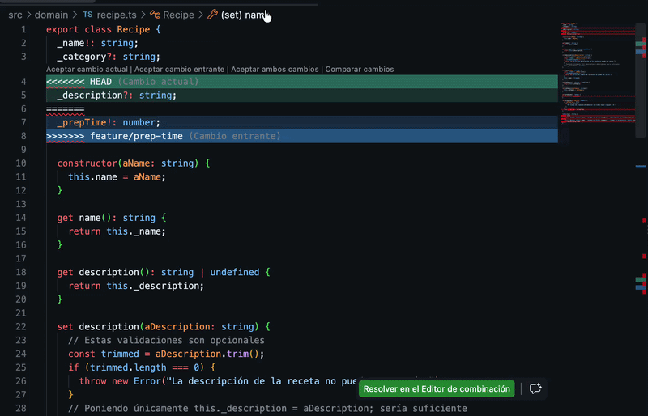
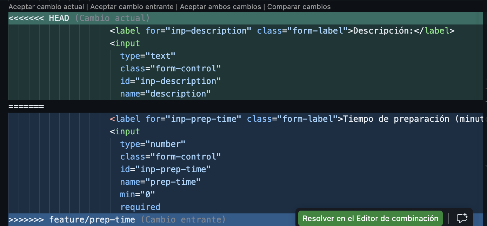
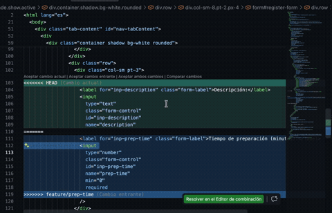
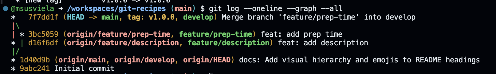

# Solución

> Esta solución es una guía. Hay muchas formas posibles de solucionarlo. Ante cualquier duda, nos pueden escribir :D 

## Parte 1 — Configurar las ramas base

> 1. Creá la rama `develop` a partir de `main` y realiza push en el repositorio remoto.

Para crear la rama debemos usar el comando `git branch develop` y luego el comando `git switch develop` (o `git checkout develop`) si nos queremos mover a la rama recién creada. 

De forma alternativa, se puede utilizar el comando `git checkout -b develop` para crear y moverse a la rama recién creada.

> 2. Verificá con el siguiente comando que la estructura de ramas es correcta antes de continuar: git log --oneline --graph

Se deberá visualizar algo similar:


## 📝 Parte 2 — Feature 1: Descripción de la receta

> 1. Desde `develop`, creá la rama `feature/description`.

Ejecutamos desde la rama de develop, el comando `git checkout feature/description`.

A partir de este punto, es importantísimo que estemos sobre la rama recién creada, por lo que si crearon la rama con `git branch feature/description`, deberán moverse a la rama feature/description.

> 2. En esta rama debés agregar un campo **Descripción** a la aplicación: un área de texto donde el usuario pueda escribir los pasos o ingredientes de la receta. Al agregar una receta se debe mostrar en la lista de recetas su descripción.

Para este punto hay que seguir el recorrido completo del dato. La descripción debe:

1. Escribirse en un campo del formulario.
2. Viajar desde el HTML hasta `main.ts`.
3. Guardarse dentro del objeto `Recipe`.
4. Incluirse en el texto que se agrega a la lista de recetas.

Es decir, no alcanza con agregar un campo visual al formulario. También tenemos que indicar qué hacemos con el valor que el usuario escribió y cómo queremos mostrarlo después.

Por lo tanto, nos interesa modificar los siguientes archivos:
- [Clase receta y método toString para mostrar en pantalla - ./src/domain/recipe.ts](./src/domain/recipe.ts)
- [Formulario HTML - ./index.html](./index.html)
- [Clase que conecta HTML y lógica de negocio (main.ts) - ./src/interface/main.ts](./src/interface/main.ts)

Se puede comenzar tanto con el HTML como por la clase `Recipe`. Luego se procederá con el archivo `main.ts` para poder vincular ambas lógicas: la lógica de negocio y la interfaz de usuario.

**Los cambios realizados pueden verse en el siguiente commit:**

[Commit](https://github.com/msusviela/git-recipes/commit/d16f6df7d3284badc58919a99a7acc84d4916321)

A continuación, se agregarán también algunas consideraciones que se tuvieron a la hora de realizar el ejercicio y que pueden servir para resolver problemas similares.

### Cambios en Recipe.ts

La clase `Recipe` representa una receta. Por eso, si una receta ahora tiene una descripción, la clase debe tener un lugar/atributo donde guardar ese dato:

```ts
_description?: string;
```

El guion bajo indica que se trata del atributo interno de la clase. Para acceder a él usamos un `get` y un `set`. Si no se define esto, no se podrá acceder a este dato desde otra clase u otro archivo, como por ejemplo el main.ts:

```ts
get description(): string {
  return this._description;
}

set description(aDescription: string) {
  this._description = aDescription;
}
```

Para los gets y sets pueden usar como referencia la sintaxis de los otros getters y setters del código.

Gracias a estos métodos, desde `main.ts` podemos escribir lo siguiente cuando queramos definir esta variable:

```ts
newRecipe.description = inpDescription.value;
```

El `set` recibe el texto y lo almacena en `_description`. Más adelante, cuando necesitemos leerlo, el `get` nos permite usar `newRecipe.description` sin acceder directamente a `_description`.

#### ¿Por qué hay que modificar `toString()`?

Esta es la parte más importante. La descripción puede estar correctamente guardada en el objeto y, aun así, no verse en la pantalla. Para entender por qué, hay que mirar qué hace `main.ts` cuando agrega una receta a la lista:

```ts
const li = document.createElement("li");
li.innerText = newRecipe.toString();
recipesList.appendChild(li);
```

La línea `li.innerText = newRecipe.toString()` toma el texto que devuelve `toString()` y lo coloca dentro del elemento `<li>` que el usuario ve en la lista.

Actualmente, si el método es:

```ts
toString(): string {
  return `Receta: ${this.name} - categoría: ${this.category}`;
}
```

la pantalla solamente puede mostrar el nombre y la categoría, porque son los únicos datos que forman parte del texto devuelto. El método no muestra automáticamente todos los atributos del objeto.

Por eso debemos agregar la descripción al `return`:

```ts
toString(): string {
  return `Receta: ${this.name} - categoría: ${this.category} - descripción: ${this.description}`;
}
```

Podemos pensarlo como una cadena de pasos:

```text
campo del formulario
	↓
inpDescription.value
	↓
newRecipe.description = inpDescription.value
	↓
newRecipe.toString()
	↓
li.innerText
	↓
texto visible en la lista
```

Por ejemplo, si el usuario ingresa:

- Nombre: `Tarta de manzana`
- Categoría: `Postre`
- Descripción: `Mezclar las manzanas con azúcar y hornear.`

el objeto guarda esos tres datos y `toString()` produce:

```text
Receta: Tarta de manzana - categoría: Postre - descripción: Mezclar las manzanas con azúcar y hornear.
```

Ese es exactamente el texto que `main.ts` coloca en el `<li>`. Por eso modificar `toString()` es necesario: es el método que define la representación de la receta cuando queremos convertirla en texto para mostrarla.

### Cambios en HTML

Se deberá agregar un campo de texto para que el usuario pueda escribir la descripción. Como en este ejercicio se utilizará una sola línea, podemos usar la etiqueta `input`, igual que con el nombre de la receta:

```html
<label for="inp-description" class="form-label">Descripción:</label>
<input
  type="text"
  class="form-control"
  id="inp-description"
  name="description"
  placeholder="Ingrese los pasos o ingredientes"
  required
/> 
```

El atributo `id="inp-description"` es fundamental. Es el identificador que permite que `main.ts` encuentre este elemento:

```html
const inpDescription = document.getElementById(
  "inp-description",
) as HTMLInputElement | null;
```

El `id` funciona como un nombre único para conectar el formulario HTML con el código TypeScript. Si el HTML usa un `id` y `main.ts` busca otro distinto, la conexión no se produce.

### Cambios en `main.ts`

En este archivo se conectan los elementos del HTML con la clase `Recipe`. Primero se obtiene el nuevo campo mediante su `id`:

```ts
const inpDescription = document.getElementById(
	"inp-description",
) as HTMLInputElement | null;
```

Como Typescript es tipado, tenemos que poner el tipo. En este caso, HTMLInputElement. Esto lo podemos inferir del campo nombre, ya que ambos son del tipo input.

Después, el campo debe incluirse en la condición que verifica que todos los elementos necesarios existan. Si no lo agregamos, el botón no configurará el evento correctamente cuando falte ese elemento (es algo más vinculado a programación defensiva de que funcione todo exhaustivamente, puede funcionar si no lo agregamos):

```ts
if (btnAdd && inpName && inpCategory && inpDescription) {
```

Dentro del evento del botón se crea la receta, se asigna la categoría y se guarda la descripción usando el `set` de `Recipe`:

```ts
const newRecipe = new Recipe(inpName.value);
newRecipe.category = inpCategory.value;
newRecipe.description = inpDescription.value;
```

La asignación `newRecipe.description = inpDescription.value` parece una asignación común, pero internamente llama al método `set description(...)` que definimos en `Recipe`. Allí se valida y se almacena el texto. Como en el constructor no agregamos este campo, para este ejercicio no lo seteamos allí.

Por último, también hay que limpiar el campo después de agregar la receta, para que se borren los datos en el formulario una vez agregada la nueva receta. Para eso se pasa como argumento a `clearInputs`:

```ts
clearInputs(inpName, inpCategory, inpDescription);
```

Y dentro de la función se borra su valor:

```ts
function clearInputs(
  inpNameEl: HTMLInputElement,
  inpCategoryEl: HTMLSelectElement,
  inpDescriptionEl: HTMLInputElement,
) {
  inpNameEl.value = "";
  inpCategoryEl.selectedIndex = 0;
  inpDescriptionEl.value = "";
}
```

El último paso ya estaba implementado: `loadRecipeList` llama a `newRecipe.toString()` y asigna el resultado a `li.innerText`. Como modificamos `toString()` para incluir `this.description`, la descripción guardada ahora también aparece en la lista.

### Commit y cierre de Parte B

Para esta parte se deberá hacer un commit (con su add) y un push.

```
git commit -a -m "Add recipe description"
git push origin feature/description
```

> Se utilizó la flag -a en el comando de commit para automatizar el paso `git add .`
> Se utiliza la palabra origin para indicar que el push se hará hacia el repositorio remoto. Luego el nombre de la rama. Esto se hace, ya que como es la primera vez que pusheamos esta rama, el repositorio remoto no la reconoce. Ejecutando el comando push de esta forma, nos permitirá pushearla. Si se usa solo el comando `git push`, en la terminal les recomendará un comando con la flag de --set-upstream que pueden utlizar de igual modo.

## ⏱️ Parte 3 — Feature 2: Tiempo de preparación

**FUNDAMENTAL**: Moverse a develop previo a crear la rama feature/prep-time. Si no se hace ese paso, se creará la rama sobre la que estén. Si se crea la rama sobre feature/description, aparecerá el código asociado a la descripción, y no se generarán los conflictos a resolver en la parte 4.

Por lo tanto, para moverse de rama y crearla:
```bash
git switch develop
git checkout -b feature/prep-time
```

### Agregado de campo

El procedimiento es similar a agregar el campo descripción. Les dejo el commit con los cambios realizados:
[Ver commit](https://github.com/msusviela/git-recipes/commit/3bc5059372f96fb0f5d5c157f76b1caa77edafc4)

Como consideración, el campo es obligatorio con un mínimo, por lo que es necesario:
- Hacer el atributo como obligatorio. Pueden utilizar de referencia el campo de nombre en la clase Recipe. El código es análogo a ese caso.
- En el HTML, hacer que el input tenga el atributo required (Nuevamente pueden usar el campo nombre como referencia).
- Para el mínimo, pueden utilizar el atributo `min = 0` en el HTML. Para controlar el tipo, en el atributo de type de la label HTML pueden sustituir por `type="number"` y en typescript usar int como tipado.

## 🤺 Parte 4 — Merge y resolución de conflictos

> 1. Volvé a `develop` y mergeá `feature/description`.

Ejecutamos:
```bash
git checkout develop
git merge feature/description
```

Con esto nos traeremos los cambios que hicimos en feature/description a la rama develop.

> 2. Mergeá `feature/prep-time` en `develop`. Git reportará conflictos en algunos archivos.

Una vez realizado esto, ejecutamos:

```bash
git merge feature/prep-time
```

Nos traerá los cambios de feature/prep-time y es muy probable que surjan conflictos. Los conflictos aparecerán en aquellas líneas de código que fueron modificadas en ambas ramas. Puede variar dependiendo de dónde se agregó código en las ramas creadas. Lo importante aquí, es quedarnos con los cambios necesarios para que el formulario muestre ambos campos y funcionen correctamente. Puede ser necesario quedarnos con ambos cambios, o quedarnos los cambios únicamente de alguna rama y luego modificar manualmente.

Les dejo ejemplos de cómo aparecieron los conflictos y cómo se resolvieron (en esta solución).

**Lo fundamental, es una vez resueltos, realizar un add, un commit y un push con los cambios**

- Primero, importante mencionar que los archivos en los que se generaron conflictos, aparecerán a la izquierda (o derecha, según configuraciones del IDE) marcados con un signo de exclamación en Rojo.

- Otro punto importante, luego de hacer los cambios, fundamental guardar el archivo antes de proseguir con el add y el commit.

Les dejo algunos ejemplos de conflictos que aparecieron y la estrategia de resolución:

**Archivo: recipe.ts**

En este archivo nos quedamos con ambos atributos. Luego nos quedamos con cualquiera de los toString. Una vez seleccionado el toString con el que nos quedamos, modificamos para agregar el dato que falte.



**Archivo: Index.html**


Se optó por aceptar ambos cambios, pero luego **cerrar manualmente las etiquetas que faltaban cerrar**. Es importante observar que lo que git identifica como conflicto, no contempla la etiqueta de cierre input, por lo que queda como incompleta esa parte. Además, no queda cada cambio encerrado dentro de la etiqueta <row>, que si bien no es prioritario para este ejercicio, puede hacer que la interfaz de usuario se vea rama.

Les dejo un gif de como se solucionó el conflicto:



Se puede ver que el foco estuvo en asegurarse que las etiquetas estén bien cerradas y que cada input esté encerrado en una etiqueta row de HTML.

**Archivo: main.ts**

Acá seguramente convenga tomar una estrategia de quedarse con uno de los cambios y agregar los parámetros o variables que falten. Puede pasar que al quedarnos con ambos, hayan fragmentos de código que se solapen. En esos casos, conviene arreglarlo manual (como pasa en el video, al solapar los inputs).

[▶️ Ver demostración](./img/conflicto_main.mov)

Guardamos, commiteamos y pusheamos.

## 🚀 Parte 5 — Primer release

> 1. Mergeá `develop` en `main` y realizá push.

Primero nos movemos a main:
```
git switch main
```

Una vez en main, hacemos el merge con la rama de develop y luego el push.

> 2. Creá un tag para marcar el release:

En terminal ejecutamos
```bash
git tag v1.0.0
git push origin v1.0.0
```

> 3. Verificá con `git log --oneline --graph --all` que `main`, `develop` y el tag apuntan al mismo commit.

Debería aparecer algo así:



Lo importante: Que se vea la bifurcación de las ramas. Es importante también que en el último commit se vea la rama de main, al igual que el tag.